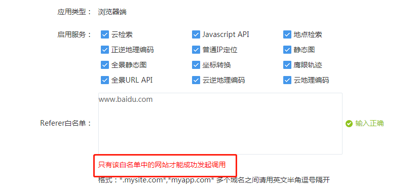
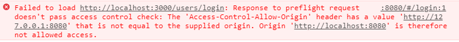
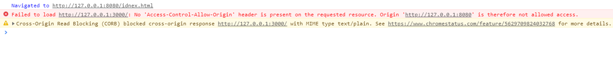
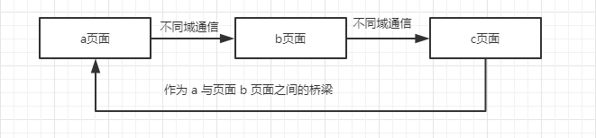

## 跨域

跨域指的是协议（protocol ），域名（host），端口号（post）都不相同的资源之间尝试着进行交互通信，而由于受浏览器同源策略的限制，无法正常进行交互通信。

最常见的实际场景就是在项目开发过程中，会存在请求第三方其他域下的资源，例如：使用地图 API 的时候，设置密钥的时候需要设置白名单才能正常使用地图 API。



使用 AJAX 请求第三方不同域下的数据资源的时候，如果不处理跨域问题，便不能成功发送 HTTP 请求，且浏览器会发出错误警告。



### 同源策略

MDN 解释： 同源策略限制了从同一个源加载的文档或脚本如何与来自另一个源的资源进行交互。这是一个用于隔离潜在恶意文件的重要安全机制。

浏览器的同源策略的目的就是为了防止 XSS，CSFR 等恶意攻击。

同源策略的交互方式有三种：

* 通常允许跨域写操作，例如链接，重定向等。
* 通常允许跨域嵌套资源，例如 img，script 标签等。
* 通常不允许跨域读操作。

### 跨域场景

只有资源之间的协议，域名和端口号都相同，才是同一个源。

下面是关于同源以及不同源之间的跨域描述。

| URL                                                          | 说明                   | 是否允许通讯 |
| ------------------------------------------------------------ | ---------------------- | ------------ |
| http://www.demo.com/a.html<br />http://www.demo.com/b.html<br />http://www.demo.com/c.html | 同一域名               | 允许         |
| http://www.demo.com/news/a.html<br />http://www.demo.com/center/b.html<br />http://www.demo.com/server/c.html | 同一域名下的不同文件夹 | 允许         |
| http://www.demo.com/a.html<br />http://www.demo.com:80/b.html | 不同端口号             | 不允许       |
| http://www.demo.com/a.html<br />https://www.demo.com/b.html  | 不同协议               | 不允许       |
| http://www.demo.com/a.html<br />http://www.test.com/b.html   | 不同域名               | 不允许       |
| http://www.demo.com/a.html<br />http://test.demo.com/b.html  | 主域相同，子域不同     | 不允许       |

### 跨域解决方案

#### 1. JSONP

由于浏览器同源策略是允许 script 标签这样的跨域资源嵌套的，所以 script 标签的资源不受同源策略的限制。

JSONP 的解决方案就是通过 script 标签进行跨域请求。

* 前端设置好回调函数，并把回调函数当做请求 url 携带的参数。
* 后端接受到请求之后，返回回调函数名和需要的数据。
* 后端响应并返回数据后，返回的数据传入到回调函数中并执行。

```javascript
<!-- 通过原生使用 script 标签 -->
<script>
    function jsonpCallback(data) {
        alert('获取到的数据了，打开控制台瞧瞧');
        console.log(data);
    }
</script>
<script src="http://127.0.0.1:3000?callback=jsonpCallback"></script>
```

也可以使用 AJAX GET 请求方式来跨域请求（axios GET 方式跨域同理）。

```javascript
<!-- AJAX GET 请求 -->
<script>
    function jsonpCallback(data) {
        alert('获取到的数据了，打开控制台瞧瞧');
        console.log(data);
    }
    $.ajax({
        type: 'GET', // 必须是 GET 请求
        url: 'http://127.0.0.1:3000',
        dataType: 'jsonp', // 设置为 jsonp 类型
        jsonpCallback: 'jsonpCallback' // 设置回调函数
    })
</script>
```

优缺点： 

* 兼容性好，低版本的 IE 也支持这种方式。

* 只能支持 GET 方式的 HTTP 请求。
* 只支持前后端数据通信这样的 HTTP 请求，并不能解决不同域下的页面之间的数据交互通信问题。

#### 2. CORS

CORS 跨域资源共享允许在服务端进行相关设置后，可以进行跨域通信。

服务端未设置 CORS 跨域字段，服务端会拒绝请求并提示错误警告。



服务端设置 Access-Control-Allow-Origin 字段，值可以是具体的域名或者 '*' 通配符，配置好后就可以允许跨域请求数据。

```javascript
<script>
    $.ajax({
    type: 'post',
    url: 'http://127.0.0.1:3000',
    success: function(res) {
        alert('获取到的数据了，打开控制台瞧瞧');
        console.log(res);
    }
})
</script>
```

服务端如何设置跨域字段？ 后端语言设置跨域的方式都不一致，具体可参考后端语言本身的 API。

Node 端设置

```javascript
res.writeHead(200, {
    'Access-Control-Allow-Origin': '*'
});

// 或者使用了 Express 这样的框架
res.header("Access-Control-Allow-Origin", "*");
```

关于 CORS 的详细，可以参考这篇笔记，[CORS跨域资源共享](./CORS跨域资源共享.md)。

#### 3. **Server Proxy** 

通过服务端代理请求的方式也是解决浏览器跨域问题的方案。同源策略只是针对浏览器的安全策略，服务端并不受同源策略的限制，也就不存在跨域的问题。具体步骤如下：

* 前端正常请求服务端提供的接口。比如请求接口：http://localhost:3000 。
* 通过服务端设置代理发送请求，请求到数据后再将需要的数据返回给前端。比如设置的代理请求接口是 https://cnodejs.org/api/v1/topics ，服务端代理将数据请求回来之后再将数据 http://localhost:3000 接口返回给前端。

```javascript
// 服务端代理请求代码
// 服务端只是简单的通过正常的 HTTP 请求的方式来代理请求接口数据
// 或者也可以使用 proxy 模块来代理，至于怎么使用 proxy 模块，待研究完善
var url = 'https://cnodejs.org/api/v1/topics';        
https.get(url, (resp) => {
    let data = "";
    resp.on('data', chunk => {
        data += chunk;
    });
    resp.on('end', () => {
        res.writeHead(200, {
            'Access-Control-Allow-Origin': '*',
            'Content-Type': 'application/json; charset=utf-8'
        });
        res.end(data);
    });
})
```

#### 4. location.hash + iframe

location.hash + iframe 跨域通信的实现是这样的：

* 不同域的 a 页面与 b 页面进行通信，在 a 页面中通过 iframe 嵌入 b 页面，并给 iframe 的 src 添加一个 hash 值。
*  b 页面接收到了 hash 值后，确定 a 页面在尝试着与自己通信，然后通过修改 parent.location.hash 的值，将要通信的数据传递给 a 页面的 hash 值。
* 但由于在 IE 和 Chrmoe 下不允许子页面直接修改父页面的 hash 值，所以需要一个代理页面，通过与 a 页面同域的 c 页面来传递数据。
* 同样的在 b 页面中通过 iframe 嵌入 c 页面，将要传递的数据通过  iframe 的 src 链接的 hash 值传递给 c 页面，由于 a 页面与 c 页面同域，c 页面可以直接修改 a 页面的 hash 值或者调用 a 页面中的全局函数。

大致流程就是： 



a 页面代码

```javascript
<script>
    var iframe = document.createElement('iframe');
    iframe.style.display = 'none';
    iframe.src = "http://localhost:8081/b.html#data";
    document.body.appendChild(iframe);

    function checkHash() {
        try {
            var data = location.hash ? location.hash.substring(1) : '';
            console.log('获得到的数据是：', data);
        }catch(e) {}
    }
    window.addEventListener('hashchange', function(e) {
        console.log('监听到hash的变化：', location.hash.substring(1));
    })
</script>
```

b 页面代码

```javascript
<script>
     switch(location.hash) {
         case '#data':
         callback();
         break;
     }
    function callback() {
        var data = "testHash"
        try {
            parent.location.hash = data;
        }catch(e) {
            var ifrproxy = document.createElement('iframe');
            ifrproxy.style.display = 'none';
            ifrproxy.src = 'http://localhost:8080/c.html#' + data;
            document.body.appendChild(ifrproxy);
        }
    }
 </script>  
```

c 页面代码

```javascript
<script>
    // 修改 a 页面的 hash 值
    parent.parent.location.hash = self.location.hash.substring(1);
	// 调用 a 页面的全局函数	
	parent.parent.checkHash();
</script>
```

优缺点：

* hash 传递的数据容量有限。
* 数据直接暴露在 url 中。

#### 5. document.**domain** + iframe 

该方案只限于主域相同子域不同的资源跨域解决方案。

实际应用场景：

之前的项目开发中，经常碰到这样的跨域问题，大致类似于在开发新产品的产品页中，在没有正式上线之前，一般都是上传到内部的测试环境中，比如测试环境的域名是 test.admin.com/xxx/xxx，而项目的测试环境的域名是 consumer-test.admin.com/xxx/xxx 这样的，产品页是单独分离部署上线，再通过 iframe 嵌套到项目中。在内部测试过程中，由于产品页测试环境和项目测试环境主域相同而子域不同，且产品页中需要用到项目中定义的全局公共资源，由于跨域问题，这些公共资源是获取不到的。

这种场景的跨域解决方案就是利用 document.domain 设置。在产品页和项目中将 document.domain 设置成相同域就可以实现跨域，嵌套的产品页就可以访问父页面的公共资源了。需要注意的一点就是，document.domain 的设置是有限制的，只能设置成自身或者更高级的父域，且主域必须相同。

项目页面

```javascript
<iframe src="test.admin.com/xxx/xxx"></iframe>
<script>
	document.domain = 'admin.com';
</script>
```

产品页

```javascript
<script>
    // 设置之后就可获取项目页面中定义的公共资源了
	document.domain = 'admin.com';
</script>
```

#### 6. window.name + iframe

window.name 指的是当前浏览器窗口的名称，默认为空字符串，每个窗口的 window.name 都是独立的。iframe 嵌套的页面中也有属于自己的 window 对象，这个 window 是top window 的子窗口，也同样拥有 window.name 的属性。

window.name 的独特之处在于当在页面设置 window.name 的值，其实就是相当于给这个窗口设置了名称，而后在这个窗口加载其他页面（甚至不同域的页面），window.name 的值依然存在（如果没有重新设置那么值不会变化），并且 window.name 的值支持比较大的存储（2MB）。

例如： 随便找个页面打开控制台，给当前窗口设置名称。

```javascript
window.name = 'test-name';
```

设置好之后可以在这个窗口下跳转到其他页面

```javascript
window.location = 'https://www.baidu.com';
```

页面跳转到了百度首页，但是 window.name 的值依然是之前设置的值，因为是在一个窗口中跳转的页面，窗口名称并不会被修改。

具体的跨域解决方式如下。

http://localhost:8080/a.html 与 http://localhost:8081/b.html 跨域通信，a 页面通过 iframe 嵌套 b 页面，b 页面中设置好  window.name  的值，由于是不同域，a 页面不能直接访问到 b 页面设置的 window.name 的值，需要一个与 a 页面同域的中间页来代理作为 a 页面与 b 页面通信的桥梁。

a.html

```  javascript
<script>
	var data = null;
	var state = 0;
	var iframe = document.createElement('iframe');
	iframe.src = "http://localhost:8081/b.html";
	iframe.style.display = 'none';
	document.body.appendChild(iframe);
	
	// 第一次加载先加载 b.html，b.html 设置好了 window.name 的值
	// 而后加载 c.html，c.html 的 window.name 的值就是之前 b.html 设置的值
	// 同域的情况下，a.html 可以通过 iframe.contentWindow.name 获取到 b.html 中 windoa.name 的值
	iframe.onload = function() {
		if(state === 0) {
			iframe.src = "http://localhost:8080/c.html";
			state = 1;
		}else if(state === 1) {
			data = iframe.contentWindow.name;
			console.log('收到数据:', data);
		}
	}
</script>
```

b.html

```javascript
<script>
    window.name = '这是传递的数据';
</script>
```

中间代理页，只需要跟 a 页面保持同域就可以了，例如： http://localhost:8080/c.html 。

#### 7. window.postMessage

postMessage 是 HTML5 的新特性，用于页面之间跨域通信。

postMessage 方法接受两个必要的参数：

* message: 需要传递的数据。
* targetOrigin: 数据传递的目标窗口域名，值可以是具体的域名或者 '*' 通配符。

a.html

```javascript
<iframe src="http://localhost:8081/b.html" style='display: none;'></iframe>
<script>
	window.onload = function() {
		var targetOrigin = 'http://localhost:8081';
		var data = {
			name: '武林外传',
			time: 2005,
			length: 81,
			address: '同福客栈'
		};
		// 向 b.html 发送消息
		window.frames[0].postMessage(data, targetOrigin);

		// 接收 b.html 发送的数据
		window.addEventListener('message', function(e) {
			console.log('b.html 发送来的消息:', e.data);
		})
	}
</script>
```

b.html

```javascript
<script>
	var targetOrigin = 'http://localhost:8080';
	window.addEventListener('message', function(e) {
		if(e.source != window.parent) {
			return;
		}
		// 接收 a.html 发送的数据
		console.log('a.html 发送来的消息:', e.data);
		// 向 a.html 发送消息
		parent.postMessage('哈哈，我是b页面，我收到你的消息了', targetOrigin);
	})
</script>
```


### 总结

* 协议，域名，端口号不相同的资源之间相互通信，就会产生跨域问题。

* 处于安全考虑，浏览器的同源策略限制了不同域之间相互通信。

* JSONP，CORS，Server Proxy 跨域解决方式的应用场景都是用于前后端之间的数据通信，其他跨域解决方案主要是解决窗口页面之间的数据通信。

* JSONP 只支持 GET 方式的 HTTP 请求。

* CORS 跨域资源请求需要后端支持。

* Server Proxy 直接让后端代理发送请求。

  

### 后记

所有的跨域解决方案都有对应的 DEMO 实例，可在 [DEMO](./DEMO/) 中查看。想要看运行效果，可以全局安装 http-server 模块。

``` 
npm install -g http-server
```


### 参考

* https://zhuanlan.zhihu.com/p/25778815
* https://segmentfault.com/a/1190000011145364
* https://segmentfault.com/a/1190000000718840
* https://juejin.im/post/5815f4abbf22ec006893b431
* https://juejin.im/post/59c132415188256bb018e825