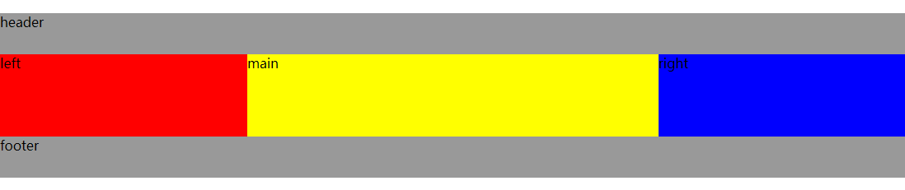

## 圣杯布局&双飞翼布局

### 前言

圣杯布局和双飞翼布局的出现，都是为了实现左右两侧宽度固定，中间内容宽度自适应的三栏布局，且三栏布局的特点是中间内容优先渲染显示（一般情况下重要内容都是放置在布局的中间），也就是在布局结构中，中间内容的结构位于最上面（不是传统的上下，左右结构）。两种布局方式的目的一致但是实现思路不一样，圣杯布局是由国外大佬提出来的，双飞翼布局是由淘宝内部实现的。

### 圣杯布局

圣杯布局实现思路大致是：

* 三块内容都要设置向左浮动
* 中间内容宽度设置成 100%，左右两边固定宽度
* 左右两块内容设置负边距，将左右两侧内容和中间内容放置在同一行显示
* 左右两侧内容出现遮挡了中间内容的现象，通过设置内容块的父级元素的 padding 值使中间内容宽度变小
* 左右两侧内容通过相对定位，分别设置 left 和 right 值将内容设置到左右两侧的位置

实现代码如下：

```html
<header>header</header>
<section class="holy-grail">
    <section class="col main">main</section>
    <aside class="col left">left</aside>
    <aside class="col right">right</aside>
</section>
<footer>footer</footer>

<style>
header, footer {
    height: 50px;
    background: #999999;
}
.holy-grail {
    overflow: hidden;
    padding: 0px 300px;
}
.holy-grail .col {
    float: left;
    height: 100px;
    position: relative;
}
.holy-grail .main {
    width: 100%;
    background: yellow;
}
.holy-grail .left {
    width: 300px;
    background: red;
    margin-left: -100%;
    left: -300px;
}
.holy-grail .right {
    width: 300px;
    background: blue;
    margin-left: -300px;
    right: -300px;
}
</style>
```



### 双飞翼布局

双飞翼布局的实现思路不同于圣杯布局的思路在于左右两侧内容遮挡中间内容的处理。圣杯布局的处理方式是通过设置内边距预留出左右两侧的位置，并使用相对定位配合 left 和 right 将两侧内容放置到左右两侧；双飞翼的处理方式是多创建一层 DOM 将中间内容包裹起来，通过设置包裹元素的外边距空留出左右两侧的位置。

实现代码如下：

```html
<header>header</header>
<section class="wrapper">
    <section class="col main">
        <section class="main-wrap">main</section>
    </section>
    <aside class="col left">left</aside>
    <aside class="col right">right</aside>
</section>
<footer>footer</footer>

<style>
header, footer {
    height: 50px;
    background: #999999;
    }
    .wrapper {
        overflow: hidden;
    }
    .wrapper .col {
        float: left;
        height: 100px;
    }
    .wrapper .main {
        width: 100%;
        background: yellow;
    }
    .wrapper .main-wrap {
        margin: 0px 300px;
    }
    .wrapper .left {
        width: 300px;
        background: red;
        margin-left: -100%;
    }
    .wrapper .right {
        width: 300px;
        background: blue;
        margin-left: -300px;
    }
</style>
```

### 参考

* https://alistapart.com/article/holygrail
* [圣杯布局和双飞翼布局](https://www.jianshu.com/p/f9bcddb0e8b4)
* [聊聊为什么淘宝要提出「双飞翼」布局](https://github.com/zwwill/blog/issues/11)
* [圣杯布局的实现原理](https://www.zybuluo.com/xudongh/note/557250)
* [CSS布局中圣杯布局与双飞翼布局的实现思路差异在哪里？](https://www.zhihu.com/question/21504052)
* [双飞翼布局介绍-始于淘宝UED](http://www.imooc.com/wenda/detail/254035)