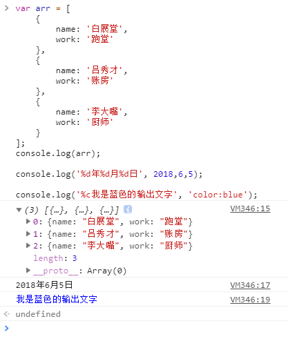
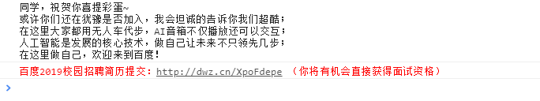
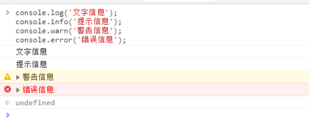
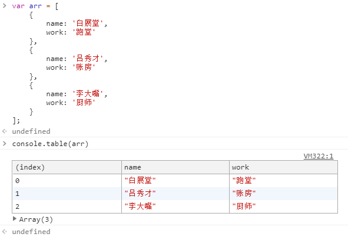
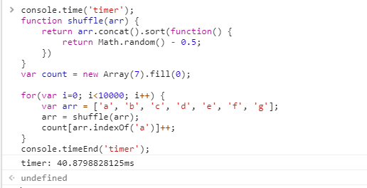

## 记录一些不常使用的 API 或知识点

### 1. console

总结下 console 一些常用的 API。

#### console.log

平时用得最多的 API，经常用于向控制台打印一些信息或数据。console.log 方法可以接受多个类型不同的参数，按照参数顺序依次输出，且支持占位符。

```javascript
var arr = [
    {
        name: '白展堂',
        work: '跑堂'
    },
    {
    	name: '吕秀才',
    	work: '账房'
    },
    {
    	name: '李大嘴',
    	work: '厨师'
    }
];
console.log(arr);

console.log('%d年%d月%d日', 2018,6,5);

console.log('%c我是蓝色的输出文字', 'color:blue');
```



实现百度页面控制台的输出信息，效果如下：



```javascript
console.log(`自己的实现\n同学，祝贺你喜提彩蛋~\n或许你们还在犹豫是否加入，我会坦诚的告诉你我们超酷；\n在这里大家都用无人车代步，AI音箱不仅播放还可以交互；\n人工智能是发展的核心技术，做自己让未来不只领先几步；\n在这里做自己，欢迎来到百度！`);
console.log(`%c百度2019校园招聘简历提交：http://dwz.cn/XpoFdepe （你将有机会直接获得面试资格）`, "color:red")
```
#### 分类信息输出

console.log 是作为普通信息输出的方法，其他类型信息输入放入如下，与 console.log 的使用类似

* console.info, 提示信息的输出
* console.warn, 警告信息的输出
* console.error, 错误信息的输出
* console.debug, 使用日志级别向控制台输出消息`"debug"` 

```javascript
console.log('文字信息');
console.info('提示信息');
console.warn('警告信息');
console.error('错误信息');
```



#### console.table

将数据以表格的形式输出。

```javascript
var arr = [
    {
        name: '白展堂',
        work: '跑堂'
    },
    {
    	name: '吕秀才',
    	work: '账房'
    },
    {
    	name: '李大嘴',
    	work: '厨师'
    }
];

console.table(arr);
```



#### console.time

启动一个计时器来跟踪某个操作的耗时时长，与 console.timeEnd 一起使用。

```javascript
console.time('timer');
function shuffle(arr) {
    return arr.concat().sort(function() {
        return Math.random() - 0.5;
    })
}
var count = new Array(7).fill(0);

for(var i=0; i<10000; i++) {
    var arr = ['a', 'b', 'c', 'd', 'e', 'f', 'g'];
    arr = shuffle(arr);
    count[arr.indexOf('a')]++;
}
console.timeEnd('timer');
```



#### 参考

https://segmentfault.com/a/1190000002511877

-------------------------------------------------------------------------------------------------------

### 2. visibilitychange 

visibilitychange 用于监听浏览器标签页显示或隐藏操作，用户切换页面的时候或者窗口最小化和非最小化的时候触发该事件，从 a 页面切换到 b 页面表示 a 页面处于隐藏状态，再切换回 a 页面处于显示状态。

visibilitychange 事件只是用于监听页面切换，那么如何判断页面切换是显示状态还是隐藏状态呢？

通过 ```document.hidden``` 来判断页面的状态（显示还是隐藏）

```javascript
document.addEventListener('visibilitychange', function() {
    if(document.hidden) {
        document.title = '页面隐藏起来了';
    }else {
        document.title = '页面显示出来了';
    }
})
```

#### 参考

https://developer.mozilla.org/zh-CN/docs/Web/API/Page_Visibility_API

-----------------------------------------------------------------------------------------------------------

### 3. 关于浏览器关闭刷新状态 

有一些应用场景，比如表单提交，用户在填写过程中无意刷新或者关闭页面，导致填写的内容丢失，如果只是一些简单的表单填写还好，要是遇到复杂的表单填写，不得不重新填写，这样用户体验很不好。那么有没有办法在用户刷新或者关闭页面的时候，给个提示让用户确认操作正确呢，从而避免无效的失误。

#### onbeforeunload 

MDN: 当窗口即将被卸载（关闭）时,会触发该事件.此时页面文档依然可见,且该事件的默认动作可以被取消。

简单来说就是刷新重新加载页面或者关闭页面窗口的时候，会先触发 onbeforeunload 事件，让用户再次确认是否关闭或者刷新页面，如果是失误操作可以动作取消。

onbeforeunload 事件需要返回一个字符串才能有效，字符串将作用在确认框上显示（从Firefox 4、 Chrome 51、Opera 38 和Safari 9.1开始，通用确认信息代替事件返回的字符串，不过返回字符串步骤不能缺失）

```javascript
window.onbeforeunload = function (e) {
    // Chrome, Safari, Firefox 4+, Opera 12+ , IE 9+
    return '关闭提示';
};
```

需要注意的是，经过测试，在 Chrome 下必须要存在 input 这样的表单输入框且必须输入内容，在关闭窗口的时候才会弹出确认窗口，否则不需要用户确认直接关闭窗口；而 IE 下便没有这样的限制。测试环境： Chrome/70，IE9。

#### onunload 

查阅资料的时候，网上很多文章都会顺带提到 onunload 事件，经过测试，该事件在 Chrmoe 下无效。

onunload 事件类似于 onbeforeunload 事件，当窗口即将被卸载（关闭）时,会触发。不同的是，onunload 更像是提示用户页面被关闭了或者页面刷新了，只是一个提醒的作用，并不会让用户进行确认操作是否正确。

```javascript
window.onunload = function(e) {
    alert("unload event detected!");
}
```

#### 参考

https://developer.mozilla.org/zh-CN/docs/Web/API/Window/onbeforeunload

----------------------------------------------------------------------------------------------------------------

