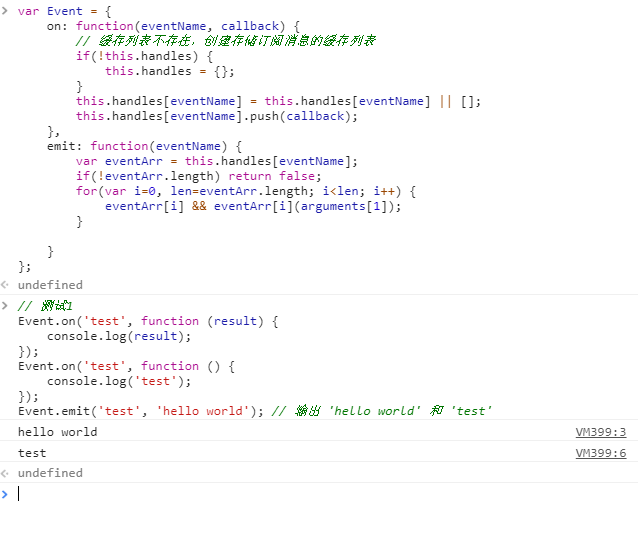
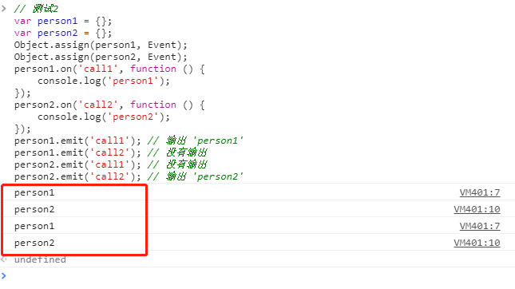
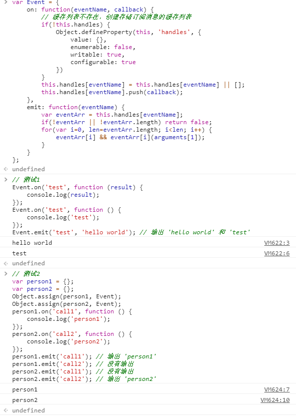

## 观察者模式

### 什么是观察者模式

观察者模式定义了对象间一种一对多的依赖关系，当一个对象的状态发生改变时，所有依赖它的对象都将得到通知，由主体（发布者）和订阅者组成，解决了主体对象和订阅者之间的耦合。

例如：面试求职。把公司作为主体对象，求职者作为订阅者，同一家公司的求职者可能有多个（一对多的依赖关系），在面试完成之后，在短时间内公司需要答复求职者是否成功录取。那么如何实现这样的一个案例？

* 创建一个主体对象（公司）
* 订阅者（求职者）订阅观察主体的动态
* 主体发布消息并广播式（发散式）的通知所有的订阅者

```javascript
// 创建主体对象
var hr = {
    // 缓存列表，用于存储订阅消息以便通知订阅者
    subs: [],
    // 将订阅消息添加进缓存列表
    addSub: function(callback) {
        this.subs.push(callback);
    },
    // 发布消息时，遍历执行订阅消息通知订阅者
    notify: function() {
        for(var i=0; i<this.subs.length; i++) {
            this.subs[i] && this.subs[i].apply(this, arguments);
        }
    }
};

// 所有的订阅者订阅的消息
hr.addSub(function(name, work, status) {
	console.log(`姓名：${name}，职位：${work}，状态：${status}`);
});

// 发布消息
hr.notify('白展堂', '前端', '成功录取');
hr.notify('吕秀才', '后端', '暂未录取');
```

上面例子中实现了一个简单的观察者模式，hr 代表主体对象，订阅者中包括白展堂和吕秀才等人。

如何按照不同岗位来订阅信息？就需要添加一个 key 标识来区分不同的订阅消息，按照 key 标识来存储对头的订阅消息，当只发布其中一种类型标识的消息时，对应标识的订阅消息遍历执行。

```javascript
var hr = {
    subs: {},
    addSub: function(key, callback) {
        // 该类型的集合不存在就创建
        this.subs[key] = this.subs[key] || [];
        this.subs[key].push(callback);
    },
    notify: function(key) {
        if(!this.subs[key] || !this.subs[key].length) return false;
        for(var i=0, len=this.subs[key].length; i<len; i++) {
            this.subs[key][i] && this.subs[key][i].apply(this, arguments);
        }
    }
};
// 前端岗位的订阅者订阅的消息
hr.addSub('前端', function(work, name, status) {
    var message = status === '成功录取' ? '下周一准时入职' : '再接再厉';
    console.log(`姓名：${name}，职位：${work}，状态：${status}，${message}`);
})
// Java岗位的订阅者订阅的消息
hr.addSub('Java', function(work, name, status) {
    var message = status === '成功录取' ? '下周一准时入职' : '再接再厉';
    console.log(`姓名：${name}，职位：${work}，状态：${status}，${message}`);
})

//面试成功者
var successList = [{
    name: '白展堂',
    work: '前端'
}, {
    name: '佟湘玉',
    work: '前端'
}, {
    name: '郭芙蓉',
    work: 'Java'
}];
//面试失败者
var failList = [
    {
        name: '李大嘴',
        work: '前端'
    },
    {
        name: '邢捕头',
        work: '前端'
    },
    {
        name: '燕小六',
        work: 'Java'
    },
    {
        name: '吕秀才',
        work: 'Java'
    }
]    

successList.forEach(function(item) {
    hr.notify(item.work, item.name, '成功录取');
})
failList.forEach(function(item) {
    hr.notify(item.work, item.name, '暂未录取');
})
```

有了订阅消息，那么如何实现取消订阅

```javascript
// 取消订阅
hr.delSub = function(key, callback) {
    if(!this.subs[key] || !this.subs[key].length) return false;
    // 如果没有传入具体的回调函数，表示需要取消 key 对应消息的所有订阅
    if(!callback) this.subs[key] = [];
    for(var i=0; len=this.subs[key].length; i<len; i++;) {
        if(this.subs[key][i] === callback) {
            this.subs[key].splice(i, 1);
        }
    }
}
```

### 面试题

在查阅资料的时候，看到了别人写的这道题。刚开始看的时候，完全是懵逼状态，无从下手，在了解了观察者模式之后，就清晰多了。

```javascript
// 面试题
// 请实现下面的自定义事件 Event 对象的接口，功能见注释(测试1)
// 该 Event 对象的接口需要能被其他对象拓展复用(测试2)

// 测试1
Event.on('test', function (result) {
    console.log(result);
});
Event.on('test', function () {
    console.log('test');
});
Event.emit('test', 'hello world'); // 输出 'hello world' 和 'test'
// 测试2
var person1 = {};
var person2 = {};
Object.assign(person1, Event);
Object.assign(person2, Event);
person1.on('call1', function () {
    console.log('person1');
});
person2.on('call2', function () {
    console.log('person2');
});
person1.emit('call1'); // 输出 'person1'
person1.emit('call2'); // 没有输出
person2.emit('call1'); // 没有输出
person2.emit('call2'); // 输出 'person2'
var Event = {
    // 通过on接口监听事件eventName
    // 如果事件eventName被触发，则执行callback回调函数
    on: function (eventName, callback) {
        //你的代码
    },
    // 触发事件 eventName
    emit: function (eventName) {
        //你的代码
    }
};
```

#### 测试1

通过测试1的代码可以看出，就是定义了两个 test 类型的消息订阅，并注册了回调函数，Event 作为主体发布 test 类型的消息，并传入了参数给回调函数，消息发布后要求第一个通知订阅消息输出传入的参数，第二个通知订阅消息输出原有的值。代码如下：

```javascript
var Event = {
    on: function(eventName, callback) {
        // 缓存列表不存在，创建存储订阅消息的缓存列表
        if(!this.handles) {
            this.handles = {};
        }
        this.handles[eventName] = this.handles[eventName] || [];
        this.handles[eventName].push(callback);
    },
    emit: function(eventName) {
        var eventArr = this.handles[eventName];
        if(!eventArr || !eventArr.length) return false;
        for(var i=0, len=eventArr.length; i<len; i++) {
            eventArr[i] && eventArr[i](arguments[1]);
        }
    }
};
```



#### 测试2

测试2的代码的意思是分别创建 person1 和 person2 的主体对象，person1 和 person2 之间的订阅，发布消息互不影响，发布不存在的类型订阅消息不会发送通知。

接着上面的代码看看测试2能否正确输出。结果如下：



很明显，输出的结果并不是题目要求的。那么问题和原因是什么且解决方案是什么？

person1 和 person2 的主体对象是通过拷贝 Event 对象实现的，代码中使用了 Object.assign 进行拷贝。

Object.assign 方法只会拷贝源对象自身的并且可枚举的属性到目标对象，且 Object.assign 只是属于浅拷贝的范畴。

```javascript
var person = [
    {
        name: '白展堂',
        age: 25
    }
];
var newPerson = Object.assign([], person);
console.log(newPerson); // [{name: '白展堂', age: 25}]
person[0].name = '李大嘴';
console.log(newPerson); // [{name: '李大嘴', age: 25}]
```

Event 对象作为源对象浅拷贝到 person1 和 person2 目标对象上，person1 和 person2 对象的 handles 缓存列表其实是共用的，指向的是同一个引用地址。在定义了 call1 和 call2 两种类型的订阅消息后，都会存储进 handles 列表，发布消息的时候原本是不存在的消息类型也会发送通知。

既然 Object.assign 只是拷贝可枚举的源对象上的属性，那么解决方案就应该从源对象上的不可枚举属性入手，将 handles 属性变成不可枚举，就不会拷贝到目标对象上，而后在执行的时候，代码中有判断 handles 不存在则会创建。利用 Object.defineProperty 来创建和修改属性的可枚举属性。

Event 对象修改如下：

```javascript
var Event = {
    on: function(eventName, callback) {
        // 缓存列表不存在，创建存储订阅消息的缓存列表
        if(!this.handles) {
            Object.defineProperty(this, 'handles', {
                value: {},
                enumerable: false,
                writable: true,
                configurable: true
            })
        }
        this.handles[eventName] = this.handles[eventName] || [];
        this.handles[eventName].push(callback);
    },
    emit: function(eventName) {
        var eventArr = this.handles[eventName];
        if(!eventArr || !eventArr.length) return false;
        for(var i=0, len=eventArr.length; i<len; i++) {
            eventArr[i] && eventArr[i](arguments[1]);
        }
    }
};
```



### 源码阅读

onfire.js 是一个很简单的事件分发的Javascript库（仅仅 `0.9kb`），简洁实用。 

了解观察者模式之后，阅读 onfire.js 源码能够加深理解。[传送门](https://github.com/hustcc/onfire.js)。

### 参考

* https://www.cnblogs.com/LuckyWinty/p/5796190.html

* https://segmentfault.com/a/1190000007248460
* https://segmentfault.com/a/1190000008746120
* http://www.alloyteam.com/2012/10/commonly-javascript-design-pattern-observer-mode/