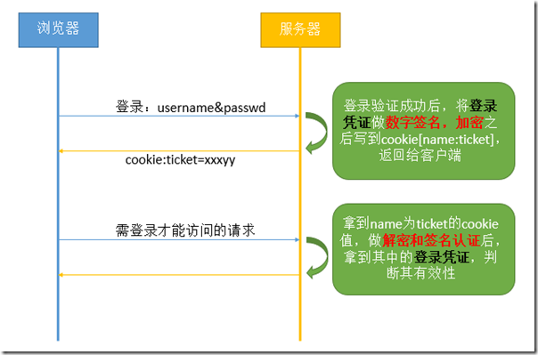
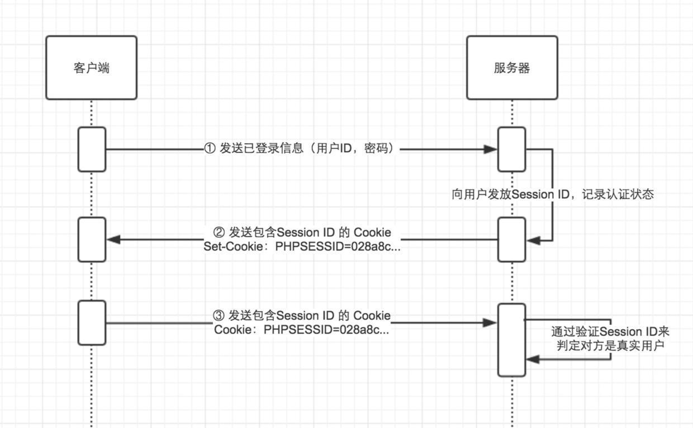
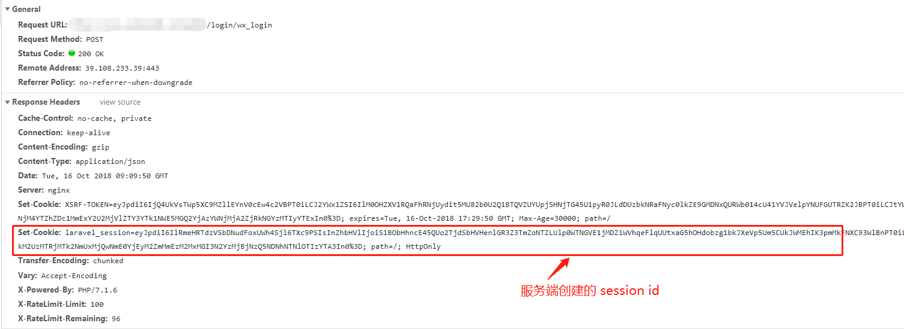
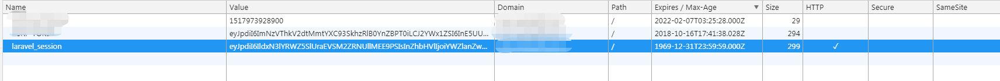
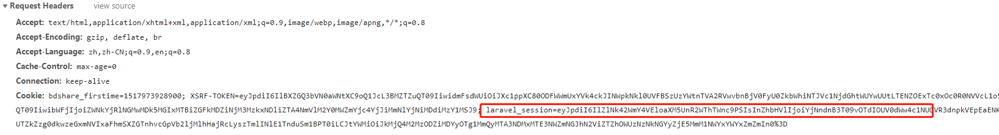
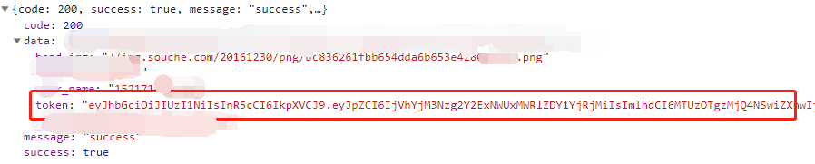
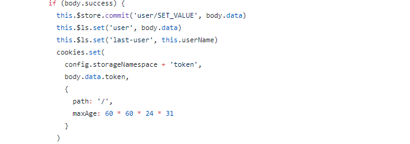
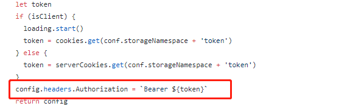
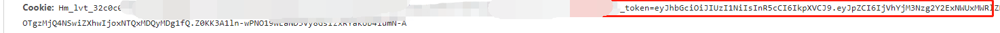
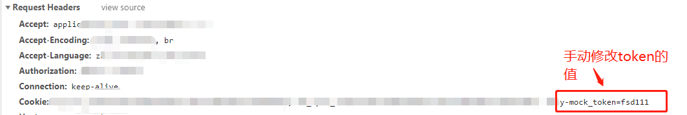

## 几种常见的认证机制

在项目开发中，经常会有登录注册的功能，那么登录注册的流程是怎样的，以及如何保持用户的登录状态的

### cookie 机制

由于 HTTP 协议是无状态的，服务器不能判断用户的身份以及登录状态。那么如何利用 cookie 来进行会话管理呢？

* 用户输入用户名和密码进行登录请求时，服务端验证接收到的用户名和密码是否正确。
* 通过验证后，服务端就会根据用户信息生成一个登录凭证，登录凭证可以设置好过期时间，并写入到响应头中的 **Set-Cookie** 字段中。
* 浏览器发现响应头中存在 Set-Cookie 字段，就把 Set-Cookie 字段写入到 cookie 中并存储在客户端的内存或磁盘中。
* 浏览器后面再发起 HTTP 请求时，服务端会要求请求头中携带 cookie。
* 服务端根据携带的 cookie 进行验证并检测是否过期，验证不通过或者过期就要求重新登录。
* 过期的 cookie 会被浏览器删除。

**缺陷：**

* cookie 大小限制
* cookie 数据容易被篡改
* cookie 可以被禁用

**小结：**

cookie 机制的大致流程就是通过 cookie 保存登录凭证，以便后续 HTTP 请求时验证登录凭证是否有效，从而保持用户的登录状态。

### session 机制

session 是存储在服务端的，避免了在客户端 cookie 中存储敏感数据。session 可以存储在服务器内存中，也可以存储在内存数据库（如 redis）中。

session 机制需要结合 cookie 来管理，类似于 cookie 机制，只是客户端存储的内容不相同而已。session 可以作为在服务器建立的一份用户档案，用户发起 HTTP 请求的时候只需要在用户档案中检索就行了。具体流程如下：

* 用户输入用户名和密码进行登录请求时，服务端验证接收到的用户名和密码是否正确。
* 通过验证后，服务端会为该用户创建一个对应的 session id 标识，并写入到响应头中的 **Set-Cookie** 字段中。
* 浏览器发现响应头中存在 Set-Cookie 字段，就把 Set-Cookie 字段写入到 cookie 中并存储在客户端。
* 浏览器后面再发起 HTTP 请求时，服务端会要求请求头中携带 cookie。
* 服务端根据携带的 cookie 进行验证并检测是否过期，验证不通过或者过期就要求重新登录。

**缺点**

* 用户数量过多，表示服务器存储的 session 就越多，当用户访问量很大时，会对服务器造成压力

**session 在项目中的应用**

现公司的后台管理系统的登录机制，采用的就是 session 机制。首次登录的时候，服务端验证登录成功之后会生成一个对应的 session id 并给到响应头中。

session id 被写入到 cookie 并保存在客户端。

可以看到，session 设置的有效期远远小于当前时间的，也就是说 session 会一直有效，直到浏览器被关闭。

每次访问页面，都会要求在响应头中携带 cookie 进行验证。

如果 session 有效且用户有访问页面的权限，就可以正常浏览页面了。	

### token 机制

token 机制验证登录状态的流程：

* 用户输入用户名和密码进行登录请求时，服务端验证接收到的用户名和密码是否正确。
* 验证通过后，服务端会通过 JWT 等方式生成对应的 token 值随着登录结果返回给客户端。
* 客户端拿到 token 值保存到本地。
* 后续发起 HTTP 请求，在请求头中将 token 值传给服务端。
* 服务端验证 token 值是否正确且是否过期，来判断用户的登录状态。
* 前端根据验证结果来判断重定向登录页还是获取页面数据。

**案例**

以 [easy-mock](https://www.easy-mock.com) 为例，easy-mock 网站的认证机制采用的就是 token。

用户登录成功之后，服务器会返回对应的 token 值

前端拿到 token 值写入到 cookie 并设置过期时间

并在每次发起 HTTP 请求时，请求头部设置携带 cookie 值让服务端验证 token 值的有效性。验证成功就获取数据，验证失败就重定向登录页。

模拟验证失败重定向登录页，手动将存储 token 的 cookie 值修改下，再去访问页面，效果如下：

服务器验证不成功，返回 401 状态码（跟后端约定好的失败状态规则），前端根据状态码重定向到登录页。

### 参考

* [3种 web 会话管理的方式](http://web.jobbole.com/89072/)
* [session与登录机制](https://juejin.im/post/5af828e96fb9a07ab83e1f10)
* [简单理解cookie/session机制](http://www.woshipm.com/pd/864133.html)
* [Cookie,Session和Token机制和区别](https://www.jianshu.com/p/013f810cdb75)
* [Session原理](https://segmentfault.com/a/1190000004627894)
* [Cookie/Session的机制与安全](https://harttle.land/2015/08/10/cookie-session.html)
* [几种常用的认证机制](https://www.cnblogs.com/xiekeli/p/5607107.html)
* [Token 认证的来龙去脉](https://segmentfault.com/a/1190000013010835)
* [单页应用 - Token 验证](https://juejin.im/post/58da720b570c350058ecd40f)
* [一个项目学会前端实现登录拦截](https://segmentfault.com/a/1190000008383094)