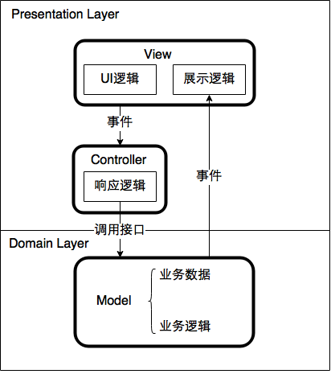
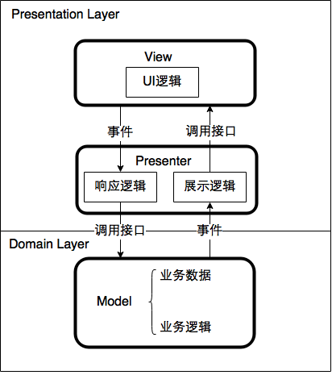
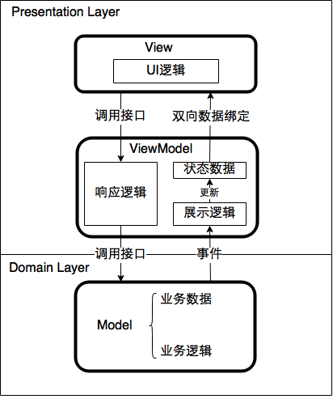

## 前端MVC/MVP/MVVM 模式

### 前言

之前有碰到过一些关于对 MVC/MVP/MVVM 模式理解的面试题，以及它们之间的异同，这里就做下简单的笔记。

由于软件架构设计模式的知识点理解起来会比较吃力，网上也很少有较权威的讲解文章，所以这里的笔记可能会存在知识点比较浅显或者错误的理解，待以后有深刻的理解后再修正，这里只记录当前对 MV* 模式的理解。

需要注意的是，这种 MV* 模式和设计模式是有区别的。MV* 模式是一种管理与组织代码的学问，其本质是一种软件开发的模型。而设计模式是在解决一类问题的基础上总结出来的解决方案，是具体写代码的方式。

且前后端的 MV* 模式是不相同的，不能混为一谈。以 MVC 模式为例区分前后端之间的区别如下：

### MVC/MVP/MVVM 是什么？之间的异同又是什么？

#### MVC

MVC 分为 3 个模块，Model(数据层)，View(视图层)，Controller(控制器)。模块之间的依赖关系如下：

* Model: 对外暴露函数调用接口和事件接口，不依赖 Controller和 View。
* View: 对外暴露用户触发事件接口，并监听 Model 数据变化触发的事件，依赖于 Model。
* Controller: 监听 View 的用户事件，并对 Model 的接口了如指掌，依赖于 Model和 View。

数据流回路流程如下：

* 用户与 View 交互，触发用户事件
* Controller 监听到用户事件，调用 Model 接口，改变 Model 层的数据
* Model 层数据变化触发相应的事件，将新的数据传递给 View 层，View 做出改变，用户得到反馈

#### MVP

MVP 分为 3 个模块，Model，View，Presenter。模块之间的依赖关系如下：

* Model: 对外暴露函数调用接口和事件接口，不依赖 Presenter 和 View。
* View:  对外暴露函数调用接口和用户触发事件接口，不依赖 Presenter 和 View。
* Presenter: 监听 View 和 Model 的事件，并对它们的接口了如指掌，所以依赖于 Model 和 View。 

数据流回路流程如下：

* 用户与 View 交互，触发用户事件
* Presenter 监听到用户事件，调用 Model 接口，改变 Model 层的数据
* Model 层数据变化触发相应的事件，事件被 Presenter 层监听到，调用 View 暴露函数调用接口，View 做出改变，用户得到反馈

#### MVVM

MVVM 分为 3 个模块，Model，View，ViewModel 。模块之间的依赖关系如下：

* Model: 对外暴露函数调用接口和事件接口，不依赖 ViewModel 和 View。
* View: 监听用户交互事件，然后调用 ViewModel 的响应逻辑，同时将自己的显示状态与 ViewModel 的状态数据绑定在一起，所以依赖于 ViewModel。 
* ViewModel: 监听 Model 的事件，并对 Model 的接口了如指掌，依赖于 Model。同时向 View 暴露响应逻辑的调用接口，以及所有的状态数据，并不依赖于 View。 

数据流回路流程如下：

* 用户与 View 交互，触发用户事件
* View 层调用起 ViewModel 层的响应逻辑的接口
* ViewModel 层的响应逻辑处理完后，调用 Model 接口，改变 Model 层的数据
* Model 层数据变化触发相应的事件，被 ViewModel 监听到，并更新 ViewModel 的数据状态
* ViewModel 层的数据状态的改变会引起 View 的状态改变，View 做出改变，用户得到反馈

#### 总结

* MVC: Controller 作为 View 层和 Model 层之间的连接点，连接 View -> Model 之间的通信，Model 层的数据更新后会通知 View 层的视图更新并反馈给用户。View 和 Model 之间的强耦合度会加大调试时的难度。
* MVP: Presenter 承接起了 View 和 Model 之间的双向通信，View 与 Model 不发生联系，降低了耦合度且方便单元测试。
* MVVM: ViewModel 中构建了一组状态数据，作为 View 状态的抽象，通过双向数据绑定使 ViewModel 中的状态数据与 View 的显示状态保持一致，这样 View 的显示状态变化会自动更新 ViewModel 的状态数据，ViewModel 状态数据的变化也会自动同步 View 的显示状态。

### 参考

* [浅析前端开发中的 MVC/MVP/MVVM 模式](https://juejin.im/post/593021272f301e0058273468)

* [浅析 MVC, MVP 与 MVVM之间的异同](http://wzhscript.com/2015/02/03/mvc-mvp-and-mvvm/)

* [浅谈 MVC、MVP 和 MVVM 架构模式](https://draveness.me/mvx)
  

