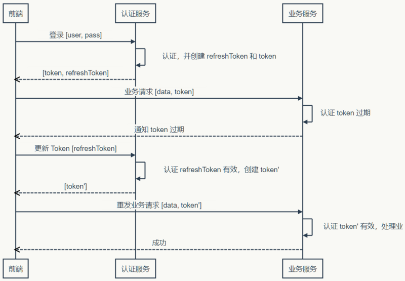

## node 实践记录

目的：搭建一个后台管理系统，数据接口使用 node + mongodb 开发

技术栈：Express + mongodb + vue

结果： 接口数据可以成功调用，但是代码结构太凌乱，为了实现而实现，没有达到理想的效果。

## Express 自动更新

通过 Express 应用生成器初始化的 node 项目，执行命令行 ``` npm start  ``` 就可以运行，但是存在的缺点就是每次修改了 node 项目的代码后必须重新启动项目，不会自动更新或者热更新。

> 解决方案

* node-dev

    一种简单的解决方案就是通过 node-dev 实现热更新。 node-dev 的定位就是为了解决 node 热更新的问题， ```Node-dev is a development tool for Node.js that automatically restarts the node process when a file is modified.```

    使用方法：
    * 安装 node-dev
        ```
        npm install -g node-dev
        ```
    * 在 package.json 文件中添加一条执行命令
        ```
        "dev":"node-dev ./bin/www"
        ```
    * 执行 ```npm run dev``` 命令启动服务   
    
    参考： [https://blog.csdn.net/c_c123/article/details/74922504](https://blog.csdn.net/c_c123/article/details/74922504)

## mongodb API

* 数据库
    * 连接/创建数据库
    ```javascript
    // 如果数据库不存在，MongoDB 将创建数据库并建立连接
    var MongoClient = require('mongodb').MongoClient;
    var url = "mongodb://localhost:27017/数据库名称";

    MongoClient.connect(url, function(err, db) {
    if (err) throw err;
    console.log("数据库已创建!");
    db.close();
    });
    ```
    * 连接/创建集合
    ```javascript
    var MongoClient = require('mongodb').MongoClient;
    var url = 'mongodb://localhost:27017/数据库名称';
    MongoClient.connect(url, function (err, db) {
        if (err) throw err;
        console.log('数据库已创建');
        var dbase = db.db("数据库名称");
        //创建集合
        dbase.createCollection('集合名称', function (err, res) {
            if (err) throw err;
            console.log("创建集合!");
            db.close();
        });
        //连接集合
        dbo.collection("集合名称");
    });
    ```

    参考：

    [http://www.runoob.com/nodejs/nodejs-mongodb.html](http://www.runoob.com/nodejs/nodejs-mongodb.html)

## node 调试

* Chrome DevTools 调试

    要求： Chrome 版本 55+，Node 版本 v7+。

    在项目根目录运行以下代码就可以进入调试
    ```
    node --inspect app.js
    ```
    或者
    ```
    node --inspect-brk app.js
    ```

    在Chrome中打开 [chrome://inspect/#devices](chrome://inspect/#devices) 点击 inspect 即可进入调试界面。

    参考：

    [https://www.cnblogs.com/aqiongbei/p/7895057.html](https://www.cnblogs.com/aqiongbei/p/7895057.html)

    [https://www.jianshu.com/p/3ed910d3866c](https://www.jianshu.com/p/3ed910d3866c)

## 登录状态及权限控制    

> token 验证机制

token 验证机制的流程大致是这样的：

* 首次登录，用户输入用户名和密码进行登录请求，后端接受到请求后验证用户名和密码，验证通过后通知前端成功登录并会生成一个 token 字段返回给前端。
* 前端拿到后端返回的 token 字段值并保存在本地，后面每次跳转页面发送请求时都要携带 token 值。
* 后端验证前端携带的 token 值和生成的 token 值是否一致，并检测 token 值是否过期。
* 前端根据验证结果来判断重定向登录页还是获取页面数据。



参考：

https://segmentfault.com/a/1190000013010835

https://juejin.im/post/5b7ea1366fb9a01a0b319612