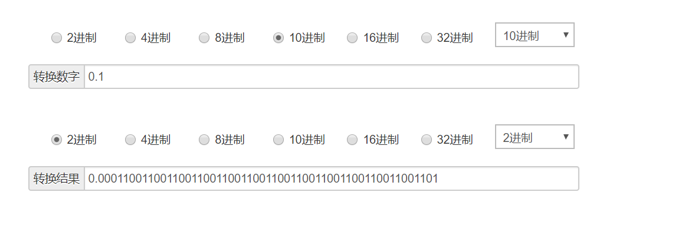
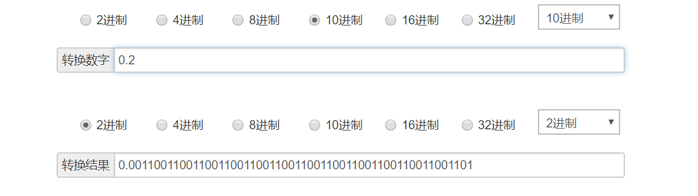

## 一道题

0.1 + 0.2 = ?

在浏览器中测试下计算结果，得到的结果是 **0.30000000000000004**，并不是理想中的 0.3 结果值。为什么会存在这样的误差呢？

## 存在的问题

小数运算会存在精度丢失的问题。

## 为什么

想要弄清这个问题，得先了解计算机是何如存储数值的。

* Number数值会被转换成对应的二进制数值，并用科学计数法表示

javascript 中的 Number 类型值可以是十进制，八进制以及十六进制的数值，在进行算数运算时，所有的八进制和十六进制的数值最终都将会被转换成十进制数值。而对于编程语言来说，所有的程序都会经过解释，编译等操作转换成CPU所能识别的语言才能运行，对于CPU来说只能识别二进制的数值，所以所有的数值都将会被转换成二进制数值存储的计算机内存中。所以，javascript在算数运算过程中的顺序应该是这样的，如果存在八进制或者十六进制数值 -> 转换成十进制数值 -> 转换成二进制数值存储的内存中。

## 精度丢失

回到刚才的问题，按照正常的流程是会先将0.1和0.2转换成二进制数值。

