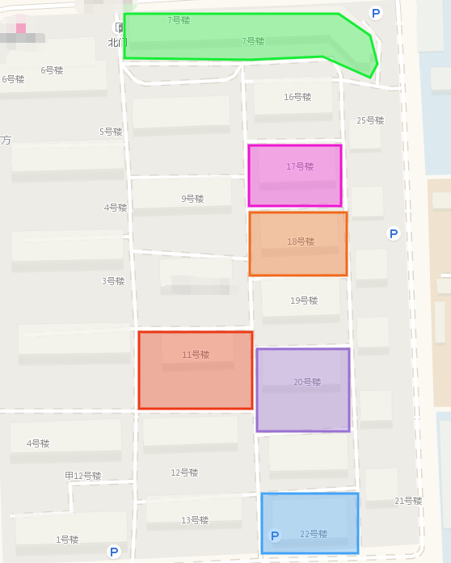
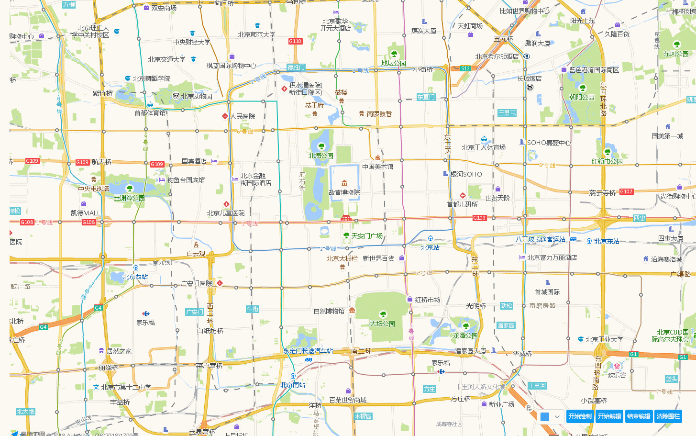

## 高德地图实现围栏的绘制和编辑

### 业务场景

之前项目业务中有这样的一个需求，大致就是需要在前台页面地图中展示出服务过的用户分布情况以及具体的数据展示，由于公司做的是服务行业，所以地图中展示要细化到一个小区一个单元楼里的服务情况。以单元楼作为基准展示围栏，且为了能够区分，围栏的样式是多样化的。

类似效果：

### 实现

实现围栏的绘制和编辑，其实就是在地图上绘制多边形矢量图形，需要使用到 MouseTool 插件和 PolyEditor 插件。具体 API 可查看[工具类](https://lbs.amap.com/api/javascript-api/reference/plugin)。

思考下具体的业务逻辑应该如何实现。

* 需要一个绘制按钮来绘制最开始的围栏雏形
* 编辑按钮来调整围栏的形状
* 结束按钮用来停止改变围栏的形状并同时可以将围栏的经纬度数据传递给后台，由后台保存记录数据，在前台展示中取出围栏的经纬度展示出围栏的具体位置
* 清除围栏按钮用于重新绘制围栏
* 颜色选择器用于调整围栏的填充色

实现效果如下：

具体代码DEMO查看这里：[demo](./demo/polygon/bmap.html)。

